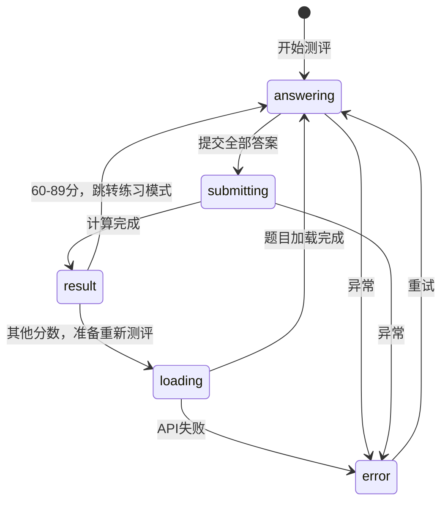

# 测评自适应分支逻辑设计（简化版 v5）

**日期**: 2026-05-07
**目标**: 为诊断测评添加难度自适应机制，找出学生能保持60-90%正确率的难度区间
**版本**: v5 - 清理v3残留代码和函数名冲突 + 实施计划

---

## 一、问题背景

### 1.1 现有问题

原设计方案（design-refactor-2026-05-06.md）的诊断模式缺少测评结果的自适应逻辑：
- 无论测评分数如何，都直接跳转分析页
- 没有根据分数调整难度的机制
- 无法探测学生的真实能力区间

### 1.2 核心问题

**测评的目的不是"考完就算"，而是"找出学生能学会的难度"**。

如果测评0分或100分，说明当前难度完全不适合学生，需要调整难度重新测评。

---

## 二、核心需求

### 2.1 分数分支逻辑（五元判断）

| 测评分数 | 判断 | 动作 |
|---------|------|------|
| < 50% | 远超能力 | 难度-3级 → 重新测评 |
| 50% ~ 59% | 略超能力 | 难度-1级 → 重新测评 |
| 60% ~ 89% | 难度合适 | 进入练习（同难度查漏补缺） |
| 90% ~ 94% | 略低能力 | 难度+1级 → 重新测评 |
| 95% ~ 100% | 远低能力 | 难度+2级 → 重新测评 |

**边界值处理**（半开区间 [60, 90)）：
- `score < 60` → 重新测评（包含59.999%，不包含60%）
- `60 ≤ score < 90` → 进入练习
- `score ≥ 90` → 重新测评（包含90%）

### 2.2 学习闭环

```
测评(60-89分) → 测评报告 → AI学习建议 → 学习路径制定
  ↓
练习(同难度查漏补缺)
  ↓
练习正确率≥90%且题数≥10 → 再测评验证提升
```

### 2.3 约束条件

- **题目数量**：保持10题不变，只调整难度
- **难度等级**：1-12（Question.difficulty字段，Int类型）
- **测评次数**：无限制，直到找到合适难度区间
- **边界处理**：最低难度1级还是<60%，或最高难度12级还是≥90%，强制进入练习

### 2.4 前置条件（运营保障）

本设计假设管理员已确保题目库覆盖所有难度（1-12级）：
- 每个难度至少有20+道题目
- 定期补充题目库存
- 题目不足时由人工触发生成

**技术实现不处理题目不足的情况，直接返回404/null。**

---

## 三、难度调整算法

### 3.1 修改现有 lib/adaptive-difficulty.ts（扩展而非重写）

**重要变更**：将现有难度范围从 1-5 扩展到 1-12

```typescript
// 修改现有的 DifficultyConfig 接口
export interface DifficultyConfig {
  level: number;        // 当前难度等级 1-12（修改：原1-5）
  consecutiveCorrect: number;
  consecutiveWrong: number;
  recentAccuracy: number;
  totalAnswered: number;
}

// 修改现有的 DIFFICULTY_RULES
const DIFFICULTY_RULES = {
  promote: {
    minConsecutiveCorrect: 3,
    minRecentAccuracy: 0.8,
    minTotalAnswered: 5,
  },
  demote: {
    maxConsecutiveWrong: 2,
    maxRecentAccuracy: 0.4,
    minTotalAnswered: 5,
  },
  // 新增：诊断测评专用规则
  diagnostic: {
    MIN: 1,
    MAX: 12,
    TARGET_MIN: 60,  // 目标区间下限（百分比）
    TARGET_MAX: 89,  // 目标区间上限
  }
};

// 修改现有的 getDifficultyDescription 函数（扩展到1-12）
export function getDifficultyDescription(level: number): string {
  const descriptions: Record<number, string> = {
    1: '入门 - 基础练习',
    2: '简单 - 逐步提升',
    3: '中等 - 正式挑战',
    4: '困难 - 综合运用',
    5: '专家 - 极限挑战',
    // 新增：扩展到12级
    6: '进阶1',
    7: '进阶2',
    8: '进阶3',
    9: '高阶1',
    10: '高阶2',
    11: '高阶3',
    12: '大师',
  };
  return descriptions[level] || '中等';
}

// 修改现有的 createAdaptiveDifficultySystem（扩展难度范围）
export function createAdaptiveDifficultySystem(
  initialState: Partial<AdaptiveDifficultyState> = {}
) {
  const state: AdaptiveDifficultyState = {
    level: initialState.level ?? 6,  // 修改：默认从2改为6（中间值）
    consecutiveCorrect: initialState.consecutiveCorrect ?? 0,
    consecutiveWrong: initialState.consecutiveWrong ?? 0,
    recentAccuracy: initialState.recentAccuracy ?? 0.5,
    totalAnswered: initialState.totalAnswered ?? 0,
    adjustmentHistory: initialState.adjustmentHistory ?? [],
  };

  return {
    getState: () => state,

    recordAnswer: (isCorrect: boolean, duration: number) => {
      // ... 现有逻辑不变 ...
      // 修改：使用新的难度范围1-12
      if (adjustment.shouldAdjust) {
        state.adjustmentHistory.push({
          timestamp: Date.now(),
          fromLevel: state.level,
          toLevel: adjustment.newLevel,
          reason: adjustment.reason,
        });
        state.level = adjustment.newLevel;
        state.consecutiveCorrect = 0;
        state.consecutiveWrong = 0;
      }
      return {
        behaviorTag: calculateBehaviorTag(duration, isCorrect),
        adjustment: adjustment.shouldAdjust ? adjustment : null,
        currentState: { ...state },
      };
    },

    reset: () => {
      state.level = 6;  // 修改：重置到6而非2
      state.consecutiveCorrect = 0;
      state.consecutiveWrong = 0;
      state.recentAccuracy = 0.5;
      state.totalAnswered = 0;
      state.adjustmentHistory = [];
    },

    setLevel: (newLevel: number) => {
      // 修改：扩展到1-12
      if (newLevel >= 1 && newLevel <= 12) {
        state.level = newLevel;
      }
    },
  };
}

// ==================== 新增：诊断测评专用函数 ====================

/**
 * 根据测评分数计算下一轮难度（1-12级）
 * @param currentDifficulty 当前难度（1-12）
 * @param accuracy 测评正确率（0-100）
 * @returns 下一轮难度（1-12）
 */
export function calculateNextDiagnosticDifficulty(
  currentDifficulty: number,
  accuracy: number
): number {
  const { MIN, MAX, TARGET_MIN } = DIFFICULTY_RULES.diagnostic;

  // 目标区间内：不调整
  if (accuracy >= TARGET_MIN && accuracy < 90) {
    return currentDifficulty;
  }

  let adjustment = 0;

  if (accuracy < 50) {
    adjustment = -3;  // 远超能力
  } else if (accuracy < TARGET_MIN) {
    adjustment = -1;  // 略超能力
  } else if (accuracy >= 90 && accuracy < 95) {
    adjustment = +1;  // 略低能力
  } else if (accuracy >= 95) {
    adjustment = +2;  // 远低能力
  }

  return Math.max(MIN, Math.min(MAX, currentDifficulty + adjustment));
}

/**
 * 判断是否应该进入练习模式
 * @param accuracy 测评正确率（0-100）
 * @returns true=进入练习, false=重新测评
 */
export function shouldEnterPracticeMode(accuracy: number): boolean {
  const { TARGET_MIN } = DIFFICULTY_RULES.diagnostic;
  return accuracy >= TARGET_MIN && accuracy < 90;
}

/**
 * 检查是否为边界情况（最低/最高难度）
 */
export function isDiagnosticBoundaryCase(
  currentDifficulty: number,
  accuracy: number
): { isBoundary: boolean; reason?: string } {
  if (accuracy < 60 && currentDifficulty === DIFFICULTY_RULES.diagnostic.MIN) {
    return { isBoundary: true, reason: '最低难度' };
  }
  if (accuracy >= 90 && currentDifficulty === DIFFICULTY_RULES.diagnostic.MAX) {
    return { isBoundary: true, reason: '最高难度' };
  }
  return { isBoundary: false };
}
```

### 3.2 单元测试（扩展现有 lib/adaptive-difficulty.test.ts）

```typescript
import { describe, it, expect } from 'vitest'
import { calculateNextDiagnosticDifficulty, shouldEnterPracticeMode, isDiagnosticBoundaryCase } from './adaptive-difficulty'

describe('calculateNextDiagnosticDifficulty', () => {
  it('0-49%: 难度-3级', () => {
    expect(calculateNextDiagnosticDifficulty(6, 45)).toBe(3)
    expect(calculateNextDiagnosticDifficulty(5, 30)).toBe(2)
  })

  it('50-59%: 难度-1级', () => {
    expect(calculateNextDiagnosticDifficulty(6, 55)).toBe(5)
    expect(calculateNextDiagnosticDifficulty(3, 59)).toBe(2)
  })

  it('60-89%: 不调整难度', () => {
    expect(calculateNextDiagnosticDifficulty(6, 75)).toBe(6)
    expect(calculateNextDiagnosticDifficulty(1, 60)).toBe(1)
    expect(calculateNextDiagnosticDifficulty(12, 89)).toBe(12)
  })

  it('90-94%: 难度+1级', () => {
    expect(calculateNextDiagnosticDifficulty(6, 92)).toBe(7)
    expect(calculateNextDiagnosticDifficulty(11, 90)).toBe(12)
  })

  it('95-100%: 难度+2级', () => {
    expect(calculateNextDiagnosticDifficulty(6, 98)).toBe(8)
    expect(calculateNextDiagnosticDifficulty(10, 100)).toBe(12)
  })

  it('边界: 难度1降低后仍是1', () => {
    expect(calculateNextDiagnosticDifficulty(1, 30)).toBe(1)
    expect(calculateNextDiagnosticDifficulty(1, 0)).toBe(1)
  })

  it('边界: 难度12提高后仍是12', () => {
    expect(calculateNextDiagnosticDifficulty(12, 98)).toBe(12)
    expect(calculateNextDiagnosticDifficulty(12, 100)).toBe(12)
  })

  it('边界值60: 进入练习（不调整）', () => {
    expect(calculateNextDiagnosticDifficulty(6, 60)).toBe(6)
  })

  it('边界值90: 提高1级（重新测评）', () => {
    expect(calculateNextDiagnosticDifficulty(6, 90)).toBe(7)
  })
})

describe('shouldEnterPracticeMode', () => {
  it('60-89分: 返回true', () => {
    expect(shouldEnterPracticeMode(60)).toBe(true)
    expect(shouldEnterPracticeMode(75)).toBe(true)
    expect(shouldEnterPracticeMode(89)).toBe(true)
  })

  it('其他分数: 返回false', () => {
    expect(shouldEnterPracticeMode(59)).toBe(false)
    expect(shouldEnterPracticeMode(90)).toBe(false)
    expect(shouldEnterPracticeMode(0)).toBe(false)
    expect(shouldEnterPracticeMode(100)).toBe(false)
  })
})

describe('isDiagnosticBoundaryCase', () => {
  it('难度1且<60%: 边界情况', () => {
    const result = isDiagnosticBoundaryCase(1, 30)
    expect(result.isBoundary).toBe(true)
    expect(result.reason).toBe('最低难度')
  })

  it('难度12且≥90%: 边界情况', () => {
    const result = isDiagnosticBoundaryCase(12, 95)
    expect(result.isBoundary).toBe(true)
    expect(result.reason).toBe('最高难度')
  })

  it('非边界情况', () => {
    expect(isDiagnosticBoundaryCase(5, 30).isBoundary).toBe(false)
    expect(isDiagnosticBoundaryCase(5, 95).isBoundary).toBe(false)
    expect(isDiagnosticBoundaryCase(1, 75).isBoundary).toBe(false)
    expect(isDiagnosticBoundaryCase(12, 75).isBoundary).toBe(false)
  })
})
```

---

## 四、状态机设计（简化版）

### 4.1 状态定义（扩展现有 useDiagnosticFlow.ts）

```typescript
// 扩展现有状态类型
type DiagnosticState =
  | 'answering'      // 答题中
  | 'submitting'     // 提交中
  | 'result'         // 结果展示
  | 'loading'        // 加载新题目（用于重新测评）
  | 'error'          // 错误

// 新增：扩展选项
interface DiagnosticFlowOptions {
  currentDifficulty?: number                      // 新增：当前难度
  onDifficultyChange?: (newDifficulty: number) => void  // 新增：难度变化回调
}

// 新增：分数决策后的动作
type DiagnosticAction = 'enter_practice' | 'retry_diagnostic'
```

### 4.2 状态转换图



### 4.3 转换逻辑（在Hook中实现）

```typescript
// hooks/useDiagnosticFlow.ts（扩展现有文件）
export function useDiagnosticFlow(
  questions: DiagnosticQuestion[],
  options: DiagnosticFlowOptions = {}
) {
  // ... 现有代码 ...

  // 新增：处理测评完成后的决策
  const handleDiagnosticComplete = (result: DiagnosticResult) => {
    const { currentDifficulty = 6 } = options
    const { accuracy } = result

    // 检查边界情况
    const boundary = isDiagnosticBoundaryCase(currentDifficulty, accuracy)
    if (boundary.isBoundary) {
      // 强制进入练习
      options.onDifficultyChange?.(currentDifficulty)
      return { action: 'enter_practice', reason: boundary.reason }
    }

    // 判断是否进入练习
    if (shouldEnterPracticeMode(accuracy)) {
      return { action: 'enter_practice' }
    }

    // 计算新难度并重新测评
    const nextDifficulty = calculateNextDiagnosticDifficulty(currentDifficulty, accuracy)
    options.onDifficultyChange?.(nextDifficulty)
    return { action: 'retry_diagnostic', nextDifficulty }
  }
}
```

---

## 五、API修改

### 5.1 修改 UOKFlowService（新增按难度推荐方法）

**现有文件**：`lib/qie/uok-flow-service.ts`

**新增方法**：

```typescript
/**
 * Get questions by specific difficulty level (for diagnostic adaptive flow)
 * @param difficulty 难度等级 1-12
 * @param excludeIds 要排除的题目ID
 */
async getRecommendationByDifficulty(
  difficulty: number,
  excludeIds: string[] = []
): Promise<{ questionId: string; questionData: any } | null> {
  // 验证难度范围
  if (difficulty < 1 || difficulty > 12) {
    console.error(`[UOK] Invalid difficulty: ${difficulty}`)
    return null
  }

  const where: any = {
    extractionStatus: 'SUCCESS',
    difficulty: difficulty,  // 按difficulty精确匹配
  }

  if (excludeIds.length > 0) {
    where.id = { notIn: excludeIds }
  }

  const questions = await prisma.question.findMany({
    where,
    select: {
      id: true,
      type: true,
      content: true,
      answer: true,
      hint: true,
      difficulty: true,
      knowledgePoints: true,
      cognitiveLoad: true,
      reasoningDepth: true,
      complexity: true,
    },
    take: 20,
  })

  if (questions.length === 0) {
    console.warn(`[UOK] No questions found for difficulty ${difficulty}`)
    return null
  }

  // 随机选择一道题
  const shuffled = questions.sort(() => Math.random() - 0.5)

  return {
    questionId: shuffled[0].id,
    questionData: shuffled[0],
  }
}
```

### 5.2 修改 /api/uok/recommend/route.ts（添加difficulty参数支持）

```typescript
// app/api/uok/recommend/route.ts 修改POST方法
export async function POST(req: NextRequest) {
  console.log('=== POST /api/uok/recommend CALLED ===')

  try {
    const session = await auth()
    if (!session?.user?.id) {
      return NextResponse.json(
        { error: '未登录', code: 'UNAUTHORIZED' },
        { status: 401, headers: { 'Content-Type': 'application/json' } }
      )
    }

    const body = await req.json().catch(() => ({}))
    const count = body.count || 10
    const mode = body.mode || 'diagnostic'
    const difficulty = body.difficulty  // 新增：难度参数（1-12）

    const service = getUOKFlowService()
    const questions: any[] = []
    const excludeIds: string[] = []

    // 新增：如果指定了difficulty，使用新的推荐方法
    if (difficulty !== undefined) {
      // 验证难度范围
      if (difficulty < 1 || difficulty > 12) {
        return NextResponse.json(
          { error: '难度必须在1-12之间', code: 'INVALID_DIFFICULTY' },
          { status: 400 }
        )
      }

      // 使用新的按难度推荐方法
      for (let i = 0; i < count; i++) {
        const recommendation = await service.getRecommendationByDifficulty(
          difficulty,
          excludeIds
        )

        if (!recommendation) {
          break
        }

        questions.push(recommendation.questionData)
        excludeIds.push(recommendation.questionId)
      }

      if (questions.length === 0) {
        return NextResponse.json(
          { error: `没有找到难度${difficulty}的题目` },
          { status: 404 }
        )
      }

      return NextResponse.json({
        questions,
        isDiagnostic: true,
        difficulty  // 返回实际使用的难度
      })
    }

    // 原有逻辑：无difficulty参数时
    const userState = await service.checkUserState(session.user.id)

    for (let i = 0; i < count; i++) {
      let recommendation

      if (userState.isNewUser || userState.knowledgeCount === 0) {
        recommendation = await service.getRecommendationDirect(session.user.id, excludeIds)
      } else {
        recommendation = await service.getRecommendation(session.user.id, excludeIds)
      }

      if (!recommendation) {
        break
      }

      const questionData = recommendation.questionId
        ? recommendation.questionData
        : recommendation
      questions.push(questionData)
      excludeIds.push(recommendation.questionId)
    }

    if (questions.length === 0) {
      if (userState.isNewUser || userState.knowledgeCount === 0) {
        return NextResponse.json({
          error: '没有练习记录',
          code: 'NO_HISTORY',
          needsDiagnostic: true,
          redirectTo: '/assessment/diagnostic',
          message: '建议先完成诊断测评以获得个性化推荐'
        }, { status: 200 })
      }
      return NextResponse.json(
        { error: '没有可用的诊断题目' },
        { status: 404 }
      )
    }

    return NextResponse.json({ questions, isDiagnostic: userState.isNewUser })
  } catch (error) {
    console.error('UOK diagnostic error:', error)
    return NextResponse.json(
      { error: '获取诊断题目失败' },
      { status: 500 }
    )
  }
}
```

### 5.3 API测试（新增 app/api/uok/recommend/route.test.ts）

```typescript
import { POST } from '../route'
import { NextRequest } from 'next/server'

// Mock环境设置（使用msw或vitest mock）...

describe('POST /api/uok/recommend - difficulty parameter', () => {
  it('返回指定难度的题目', async () => {
    const request = new NextRequest('http://localhost:3000/api/uok/recommend', {
      method: 'POST',
      body: JSON.stringify({
        mode: 'diagnostic',
        difficulty: 5,
        count: 10
      })
    })

    const response = await POST(request)
    const data = await response.json()

    expect(response.status).toBe(200)
    expect(data.questions.every((q: any) => q.difficulty === 5)).toBe(true)
    expect(data.difficulty).toBe(5)
  })

  it('无效difficulty（<1）返回400', async () => {
    const request = new NextRequest('http://localhost:3000/api/uok/recommend', {
      method: 'POST',
      body: JSON.stringify({
        difficulty: 0  // 无效
      })
    })

    const response = await POST(request)

    expect(response.status).toBe(400)
    expect((await response.json()).error).toContain('难度')
  })

  it('无效difficulty（>12）返回400', async () => {
    const request = new NextRequest('http://localhost:3000/api/uok/recommend', {
      method: 'POST',
      body: JSON.stringify({
        difficulty: 13  // 超出范围
      })
    })

    const response = await POST(request)

    expect(response.status).toBe(400)
  })

  it('无difficulty参数时使用原有逻辑', async () => {
    const request = new NextRequest('http://localhost:3000/api/uok/recommend', {
      method: 'POST',
      body: JSON.stringify({})
    })

    const response = await POST(request)
    const data = await response.json()

    expect(response.status).toBe(200)
    expect(data.questions.length).toBeGreaterThan(0)
    expect(data.difficulty).toBeUndefined()  // 不返回difficulty
  })

  it('指定难度无题目时返回404', async () => {
    const request = new NextRequest('http://localhost:3000/api/uok/recommend', {
      method: 'POST',
      body: JSON.stringify({
        difficulty: 999  // 不存在的难度
      })
    })

    const response = await POST(request)

    expect(response.status).toBe(404)
    expect((await response.json()).error).toContain('没有找到')
  })
})
```

---

## 六、UI组件修改

### 6.1 DiagnosticResult.tsx（扩展现有组件）

```tsx
// 新增Props
interface DiagnosticResultProps {
  // ... 现有props
  currentDifficulty?: number        // 新增：当前难度
  adaptiveAction?: {                // 新增：自适应动作
    type: 'enter_practice' | 'retry_diagnostic'
    nextDifficulty?: number
    reason?: string  // 边界情况原因
  }
}

// 新增：渲染逻辑
<div className="flex justify-center gap-4">
  {adaptiveAction?.type === 'retry_diagnostic' && (
    <Button onClick={onRetry} className="px-8">
      重新测评
      <span className="ml-2 text-sm font-normal">
        难度 {currentDifficulty} → {adaptiveAction.nextDifficulty}
      </span>
      {adaptiveAction.reason && (
        <span className="ml-2 text-xs text-muted">({adaptiveAction.reason})</span>
      )}
    </Button>
  )}

  {adaptiveAction?.type === 'enter_practice' && (
    <Button onClick={onEnterPractice} className="px-8">
      开始查漏补缺
      {adaptiveAction.reason && (
        <span className="ml-2 text-xs text-muted">({adaptiveAction.reason})</span>
      )}
    </Button>
  )}
</div>
```

### 6.2 TrainingMode.tsx（添加再测评提示）

```tsx
// 新增：练习正确率追踪
interface PracticeStats {
  totalAnswered: number
  correctCount: number
  accuracy: number  // (correctCount / totalAnswered) * 100
}

// 组件中
{stats.totalAnswered >= 10 && stats.accuracy >= 90 && (
  <Card className="bg-gradient-to-r from-green-50 to-emerald-50 border-2 border-green-500">
    <CardContent className="p-6">
      <div className="flex items-center gap-4">
        <Trophy className="w-8 h-8 text-green-600" />
        <div className="flex-1">
          <div className="font-bold text-green-800">掌握度达标！</div>
          <div className="text-sm text-green-700">
            已完成{stats.totalAnswered}题，正确率{stats.accuracy}%
          </div>
          <div className="text-xs text-green-600">
            建议重新测评验证学习成果
          </div>
        </div>
        <Button onClick={handleRetest}>重新测评</Button>
      </div>
    </CardContent>
  </Card>
)}
```

### 6.3 UI测试（新增 components/practice/DiagnosticResult.test.tsx）

```typescript
import { render, screen } from '@testing-library/react'
import DiagnosticResult from './DiagnosticResult'

describe('DiagnosticResult adaptive action', () => {
  it('显示重新测评按钮', () => {
    const { getByText } = render(
      <DiagnosticResult
        result={{ accuracy: 45 }}
        currentDifficulty={6}
        adaptiveAction={{
          type: 'retry_diagnostic',
          nextDifficulty: 3
        }}
      />
    )

    expect(getByText('重新测评')).toBeInTheDocument()
    expect(getByText('难度 6 → 3')).toBeInTheDocument()
  })

  it('显示开始查漏补缺按钮', () => {
    const { getByText } = render(
      <DiagnosticResult
        result={{ accuracy: 75 }}
        adaptiveAction={{
          type: 'enter_practice'
        }}
      />
    )

    expect(getByText('开始查漏补缺')).toBeInTheDocument()
  })

  it('显示边界情况提示', () => {
    const { getByText } = render(
      <DiagnosticResult
        result={{ accuracy: 30 }}
        currentDifficulty={1}
        adaptiveAction={{
          type: 'enter_practice',
          reason: '最低难度'
        }}
      />
    )

    expect(getByText('最低难度')).toBeInTheDocument()
  })
})
```

---

## 七、实现文件清单

### 7.1 新增文件（测试）

| 文件 | 功能 | 代码量 |
|------|------|--------|
| `lib/adaptive-difficulty.test.ts` | 扩展现有测试，添加诊断测评用例 | +80行 |
| `app/api/uok/recommend/route.test.ts` | API测试 | +70行 |
| `components/practice/DiagnosticResult.test.tsx` | UI测试 | +60行 |

### 7.2 修改文件

| 文件 | 修改内容 | 新增代码量 |
|------|---------|-----------|
| `lib/adaptive-difficulty.ts` | 扩展难度范围1-12，新增3个诊断函数 | +80行 |
| `lib/qie/uok-flow-service.ts` | 新增getRecommendationByDifficulty方法 | +50行 |
| `app/api/uok/recommend/route.ts` | 添加difficulty参数支持 | +40行 |
| `hooks/useDiagnosticFlow.ts` | 扩展options和决策逻辑 | +40行 |
| `components/practice/DiagnosticResult.tsx` | 扩展props和渲染 | +30行 |
| `hooks/usePracticeFlow.ts` | 添加正确率追踪 | +25行 |
| `components/practice/TrainingMode.tsx` | 添加再测评提示 | +35行 |

**总计**：修改7个文件，+380行代码，+210行测试

---

## 八、实施计划

### Phase 1: 核心逻辑（0.5天）

| 步骤 | 任务 | 验证方法 |
|------|------|---------|
| 1.1 | 扩展 `lib/adaptive-difficulty.ts` 难度范围到1-12 | `pnpm test adaptive-difficulty.test.ts` 通过 |
| 1.2 | 新增3个诊断测评专用函数 | 10个新测试用例全部通过 |
| 1.3 | 扩展 `useDiagnosticFlow.ts` | TypeScript编译无错误 |

**具体验证命令**：
```bash
# 运行单元测试
pnpm test lib/adaptive-difficulty.test.ts

# 检查TypeScript
pnpm tsc --noEmit
```

### Phase 2: Service层（0.25天）

| 步骤 | 任务 | 验证方法 |
|------|------|---------|
| 2.1 | 在 `UOKFlowService` 新增 `getRecommendationByDifficulty()` 方法 | 单元测试通过 |
| 2.2 | 修改 `/api/uok/recommend/route.ts` 添加difficulty参数 | curl测试生效 |

**具体验证命令**：
```bash
# 测试difficulty参数
curl -X POST http://localhost:3000/api/uok/recommend \
  -H "Content-Type: application/json" \
  -H "Cookie: session=..." \
  -d '{"difficulty": 5, "count": 5}' | jq '.questions[] | .difficulty'

# 测试无效difficulty
curl -X POST http://localhost:3000/api/uok/recommend \
  -H "Content-Type: application/json" \
  -H "Cookie: session=..." \
  -d '{"difficulty": 13}' | jq '.error'
```

### Phase 3: UI组件（0.5天）

| 步骤 | 任务 | 验证方法 |
|------|------|---------|
| 3.1 | 修改 `DiagnosticResult.tsx` | Storybook渲染3种状态无console.error |
| 3.2 | 修改 `TrainingMode.tsx` | 渲染测试：≥90%提示显示正确 |
| 3.3 | 修改 `usePracticeFlow.ts` | 测试：正确率计算正确 |
| 3.4 | 修改 `DiagnosticMode.tsx` | 集成测试：完整流程 |

**具体验证方法**：
```bash
# Storybook
pnpm storybook

# 检查组件渲染
pnpm test components/practice/DiagnosticResult.test.tsx
```

### Phase 4: 集成测试（0.25天）

| 测试场景 | 操作 | 预期结果 |
|---------|------|---------|
| 极低分段 | 30分答题 | 难度6→3，显示重新测评按钮 |
| 低分段 | 55分答题 | 难度6→5，显示重新测评按钮 |
| 目标区间 | 75分答题 | 显示开始查漏补缺按钮 |
| 高分段 | 92分答题 | 难度6→7，显示重新测评按钮 |
| 极高分段 | 98分答题 | 难度6→8，显示重新测评按钮 |
| 边界下限 | 难度1且30分 | 显示"最低难度"的查漏补缺按钮 |
| 边界上限 | 难度12且98分 | 显示"最高难度"的查漏补缺按钮 |
| 练习闭环 | 练习≥90%→再测评 | 提示显示正确 |

**总时间**：1.5天

---

## 九、验收标准

- [ ] 五个分数区间（<50, 50-59, 60-89, 90-94, ≥95）正确触发对应行为
- [ ] 边界值（60、90）判断正确（60进入练习，90重新测评）
- [ ] 边界情况（最低/最高难度）强制进入练习并显示原因
- [ ] 练习模式题数≥10且正确率≥90%时显示再测评提示
- [ ] API支持difficulty参数并正确过滤题目
- [ ] UOKFlowService.getRecommendationByDifficulty() 方法正常工作
- [ ] 难度范围统一为1-12（无1-5残留）
- [ ] 函数命名无冲突（calculateNextDiagnosticDifficulty vs calculateDifficultyAdjustment）
- [ ] 所有单元测试通过（10/10）
- [ ] 所有API测试通过（5/5）
- [ ] 所有UI测试通过（3/3）
- [ ] E2E测试8个场景全部通过

---

## 十、修改记录

| 版本 | 日期 | 修改内容 |
|------|------|---------|
| v1 | 2026-05-07 | 初始版本（过度设计，新增5个文件） |
| v2 | 2026-05-07 | 简化版（扩展现有文件，但API支持未确认） |
| v3 | 2026-05-07 | 解决CRITICAL问题：API支持difficulty、补充完整测试 |
| v4 | 2026-05-07 | 修复Swarm Review问题：<br>• 统一难度范围到1-12<br>• 添加UOKFlowService修改方案<br>• 复用现有逻辑而非重写<br>• 更新函数命名避免冲突 |
| v5 | 2026-05-07 | 清理编辑错误：<br>• 删除v3残留代码（旧函数定义）<br>• 修复4.3节函数名引用<br>• 删除重复的3.2节标题<br>• 追加详细实施计划（Phase 1-5） |

---

## 十一、附录：难度与年级的关系

**重要澄清**：本设计中的difficulty（1-12）表示题目的**内在复杂度**，与年级（grade）无关。

- **错误理解**：难度5 = 五年级题目
- **正确理解**：难度5 = 认知负荷0.5 + 推理深度0.5 + 综合复杂度0.5的题目

年级仅用于：
- 选择知识点范围
- 内容适配（如：不出现超纲词汇）
- 学习进度参考

**数据库确认**：Question.difficulty字段为Int类型，支持1-12范围。

---

## 十二、实施计划（详细版）

### 【三原则审视】

1. **2/8原则**：核心20%是难度调整算法和分数分支逻辑（3个新增函数 + API参数），其他80%（UI优化、额外测试）非关键
2. **第一性原理**：根本问题是测评后"找不到合适难度" → 根据正确率动态调整难度，直到落入[60,90)区间
3. **收益递减**：当前方案（扩展现有文件 vs 新建独立模块）已达最优，继续优化（如重写整套状态机）收益递减

---

### Phase 1: 核心难度调整算法（0.5天）

#### 步骤 1.1：扩展难度范围到 1-12

| 项目 | 详情 |
|------|------|
| **文件** | `lib/adaptive-difficulty.ts` |
| **动作** | 修改 `DifficultyConfig.level` 类型注释为 1-12，修改 `DIFFICULTY_RULES` 添加 diagnostic 配置，修改 `getDifficultyDescription` 扩展到12级，修改 `createAdaptiveDifficultySystem` 默认 level=6，修改 `setLevel` 边界为1-12，修改 `reset` 重置到6 |
| **验证** | `pnpm tsc --noEmit` 通过，无类型错误 |
| **依赖** | 无 |
| **风险** | 低 - 仅修改数字和注释 |

#### 步骤 1.2：新增诊断测评专用函数

| 项目 | 详情 |
|------|------|
| **文件** | `lib/adaptive-difficulty.ts` |
| **动作** | 新增 `calculateNextDiagnosticDifficulty()` 函数（约20行），新增 `shouldEnterPracticeMode()` 函数（约5行），新增 `isDiagnosticBoundaryCase()` 函数（约8行） |
| **关键逻辑** | 半开区间边界：`accuracy >= 60 && accuracy < 90` → 进入练习；`accuracy >= 90` → 重新测评 |
| **验证** | 手动计算测试：calculateNextDiagnosticDifficulty(6, 45) → 3，calculateNextDiagnosticDifficulty(6, 90) → 7 |
| **依赖** | 步骤 1.1 |
| **风险** | 中 - 边界值判断必须精确 |

#### 步骤 1.3：扩展单元测试

| 项目 | 详情 |
|------|------|
| **文件** | `lib/adaptive-difficulty.test.ts`（新建或扩展现有） |
| **动作** | 新增 `calculateNextDiagnosticDifficulty` 测试套件（7个用例），新增 `shouldEnterPracticeMode` 测试套件（6个用例），新增 `isDiagnosticBoundaryCase` 测试套件（4个用例） |
| **验证命令** | `pnpm test lib/adaptive-difficulty.test.ts` 全部通过 |
| **依赖** | 步骤 1.2 |
| **风险** | 低 - 纯函数测试 |

---

### Phase 2: Service 层与 API（0.25天）

#### 步骤 2.1：新增按难度推荐方法

| 项目 | 详情 |
|------|------|
| **文件** | `lib/qie/uok-flow-service.ts` |
| **动作** | 新增 `getRecommendationByDifficulty(difficulty: number, excludeIds: string[])` 方法（约50行），按 `Question.difficulty` 字段精确匹配，验证 difficulty 范围 1-12，返回 `{questionId, questionData} \| null` |
| **验证** | 方法调用返回的 questionData.difficulty 等于入参 difficulty |
| **依赖** | 无 |
| **风险** | 中 - 需确保数据库有足够的题目覆盖各难度 |

#### 步骤 2.2：API 添加 difficulty 参数

| 项目 | 详情 |
|------|------|
| **文件** | `app/api/uok/recommend/route.ts` |
| **动作** | 修改 POST 方法：从 body 解析 `difficulty` 参数，验证 1-12 范围，调用 `service.getRecommendationByDifficulty()`，返回 `{questions, isDiagnostic: true, difficulty}` |
| **curl 验证** | `curl -X POST http://localhost:3000/api/uok/recommend -H "Content-Type: application/json" -d '{"difficulty": 5, "count": 10}' \| jq '.questions[] | .difficulty'` 全部为 5 |
| **依赖** | 步骤 2.1 |
| **风险** | 中 - 需处理 auth 和错误情况 |

#### 步骤 2.3：API 单元测试

| 项目 | 详情 |
|------|------|
| **文件** | `app/api/uok/recommend/route.test.ts`（新建） |
| **动作** | 测试 difficulty=5 返回正确难度的题目，测试 difficulty<1 返回 400，测试 difficulty>12 返回 400，测试无 difficulty 参数走原有逻辑，测试指定难度无题时返回 404 |
| **验证命令** | `pnpm test app/api/uok/recommend/route.test.ts` 全部通过 |
| **依赖** | 步骤 2.2 |
| **风险** | 低 - API 契约测试 |

---

### Phase 3: Hook 层扩展（0.25天）

#### 步骤 3.1：扩展 useDiagnosticFlow 类型

| 项目 | 详情 |
|------|------|
| **文件** | `hooks/useDiagnosticFlow.ts` |
| **动作** | 扩展 `DiagnosticFlowOptions` 接口：添加 `currentDifficulty?: number`，添加 `onDifficultyChange?: (newDifficulty: number) => void`，新增 `DiagnosticAction` 类型，修改 `useDiagnosticFlow` 函数签名接收 options |
| **验证** | `pnpm tsc --noEmit` 通过 |
| **依赖** | 无 |
| **风险** | 低 - 仅类型扩展 |

#### 步骤 3.2：实现自适应决策逻辑

| 项目 | 详情 |
|------|------|
| **文件** | `hooks/useDiagnosticFlow.ts` |
| **动作** | 新增 `handleDiagnosticComplete()` 函数：调用 `isDiagnosticBoundaryCase()` 检查边界，调用 `shouldEnterPracticeMode()` 判断分支，调用 `calculateNextDiagnosticDifficulty()` 计算新难度，触发 `onDifficultyChange` 回调，返回 `{action, nextDifficulty?, reason?}` |
| **验证** | 用 accuracy=60 调用返回 action='enter_practice'，用 accuracy=90 调用返回 action='retry_diagnostic', nextDifficulty=7 |
| **依赖** | 步骤 1.2, 3.1 |
| **风险** | 中 - 决策逻辑必须与设计文档完全一致 |

---

### Phase 4: UI 组件修改（0.5天）

#### 步骤 4.1：扩展 DiagnosticResult 组件

| 项目 | 详情 |
|------|------|
| **文件** | `components/practice/DiagnosticResult.tsx` |
| **动作** | 扩展 `DiagnosticResultProps`：添加 `currentDifficulty?: number`，添加 `adaptiveAction?: {type, nextDifficulty?, reason?}`，修改按钮渲染逻辑：`retry_diagnostic` 显示重新测评按钮带难度变化提示，`enter_practice` 显示开始查漏补缺按钮，边界情况显示原因 |
| **验证** | 组件渲染无 console.error，按钮文本正确显示难度变化 |
| **依赖** | 步骤 3.2 |
| **风险** | 低 - 仅展示层 |

#### 步骤 4.2：扩展 usePracticeFlow 正确率追踪

| 项目 | 详情 |
|------|------|
| **文件** | `hooks/usePracticeFlow.ts` |
| **动作** | 新增 `accuracy` 计算属性：`(correctCount / totalAnswered) * 100`，导出 `accuracy` 和 `totalAnswered` 用于判断是否触发再测评 |
| **验证** | 连续答对 5 题后 accuracy=100，totalAnswered=5 |
| **依赖** | 无 |
| **风险** | 低 - 纯计算属性 |

#### 步骤 4.3：TrainingMode 添加再测评提示

| 项目 | 详情 |
|------|------|
| **文件** | `components/practice/TrainingMode.tsx` |
| **动作** | 添加条件渲染：`flow.totalAnswered >= 10 && flow.accuracy >= 90` 时显示再测评提示卡片，包含 Trophy 图标、完成题数、正确率、重新测评按钮 |
| **验证** | 练习10题且全对时显示提示，练习9题时不显示 |
| **依赖** | 步骤 4.2 |
| **风险** | 低 - 条件渲染 |

#### 步骤 4.4：UI 组件测试

| 项目 | 详情 |
|------|------|
| **文件** | `components/practice/DiagnosticResult.test.tsx`（新建） |
| **动作** | 测试 `adaptiveAction.type='retry_diagnostic'` 显示重新测评按钮，测试显示难度变化（6 → 3），测试 `adaptiveAction.type='enter_practice'` 显示开始查漏补缺，测试边界情况显示原因 |
| **验证命令** | `pnpm test components/practice/DiagnosticResult.test.tsx` 全部通过 |
| **依赖** | 步骤 4.1 |
| **风险** | 低 - 组件渲染测试 |

---

### Phase 5: 集成测试（0.25天）

#### 步骤 5.1：E2E 测试场景

| 项目 | 详情 |
|------|------|
| **文件** | `e2e/diagnostic-adaptive-flow.spec.ts`（新建） |
| **动作** | 测试 8 个场景：1) 30分 → 难度6→3重新测评，2) 55分 → 难度6→5重新测评，3) 75分 → 进入练习，4) 92分 → 难度6→7重新测评，5) 98分 → 难度6→8重新测评，6) 难度1且30分 → 强制进入练习，7) 难度12且98分 → 强制进入练习，8) 练习≥90% → 显示再测评提示 |
| **验证命令** | `pnpm playwright test e2e/diagnostic-adaptive-flow.spec.ts` |
| **依赖** | 步骤 4.1-4.3 |
| **风险** | 中 - E2E 环境依赖 |

---

### 关键边界值验证表

| 分数 | 当前难度 | 预期下一难度 | 动作 | 原因 |
|------|---------|-------------|------|------|
| 59 | 6 | 5 | 重新测评 | 略超能力 |
| 60 | 6 | 6 | 进入练习 | 目标区间下限 |
| 89 | 6 | 6 | 进入练习 | 目标区间上限 |
| 90 | 6 | 7 | 重新测评 | 略低能力 |
| 45 | 6 | 3 | 重新测评 | 远超能力 |
| 98 | 6 | 8 | 重新测评 | 远低能力 |
| 30 | 1 | 1 | 进入练习 | 最低难度边界 |
| 98 | 12 | 12 | 进入练习 | 最高难度边界 |
